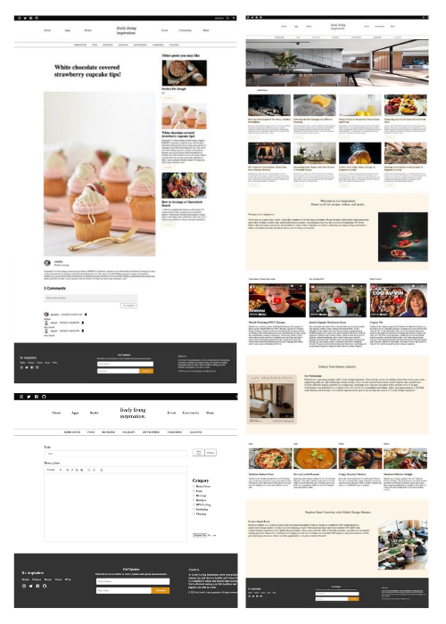

# lively living inspiration

Liv Inspiration is a dynamic community where enthusiasts celebrate the art of living well. Whether you're into culinary delights or home improvement, it's a space where people share interests, drawing and giving inspiration. Join for a vibrant exchange of ideas at Liv Inspiration.

[Front-end Repo](https://github.com/jclairelee/liv_client) | [Back-end Repo](https://github.com/jclairelee/liv_api) | [Demo](https://liv-inspiration.netlify.app/)



## Overview

This project was created to contribute to my portfolio, showcasing skills in full-stack development and demonstrating my experience with:

1. Develop React reusable components for Create, Read, Update, Delete (CRUD) operations
2. Establish RESTful APIs for client-server communication
3. Implement JWT-based authentication with React Context API and cookie storage for login/logout
4. Conduct server-side development using Node.js + Express.js
5. Construct and interact with MySQL databases for data management

## Installation

1. **Clone the Client and API Repositories:**

   For Client:

   ```bash
   git clone -b feature-1 https://github.com/jclairelee/liv-client.git
   ```

   For API:

   ```bash
   git clone -b feature-1 https://github.com/jclairelee/liv-api.git
   ```

2. **Navigate to the project directory:**

   For Client:

   ```bash
   cd liv-client
   ```

   For API:

   ```bash
   cd liv-api
   ```

3. **Install Dependencies in Each Repository:**

   ```bash
   npm install
   ```

4. **Configuration with .env:**

   Before running the application, create a `.env` file in the root of the project with the following variables:

   ```bash
      # MySQL Database Configuration
      DB_HOST=your_database_host
      DB_PORT=your_database_port
      DB_NAME=your_database_name
      DB_PASSWORD=your_database_password
      DB_USER=your_database_user

      # JWT Secret Key
      JWT_SECRET_KEY=your_secret_key

      # Application Port
      PORT=your_application_port
   ```

5. **Run Both Client and API:**

   ```bash
   npm start
   ```

## Dependencies

This project uses the following dependencies:

Front End:

- Material-UI Icons
- Material-UI Core
- Axios
- Moment
- ReactJS
- React Quill
- React Router DOM
- Sass

Back End:

- Bcrypt
- NodeJS
- Cookie-parser
- Cors
- Dotenv
- Express
- Jsonwebtoken
- Multer
- Mysql
- Parser

## Database Structure

The database comprises three key tables: [comments](#1-comments-table), [posts](#2-posts-table) and [users](#3-users-table). The `comments` table connects to `users` and `posts` through the 'userID' and 'postID' foreign keys. Simultaneously, the `posts` table refers back to the `users`` table using the userID foreign key.

### 1. `comments` Table

The `comments` table stores information related to user comments on posts.

#### Columns:

- **id:** Unique identifier for each comment.
- **text:** The content of the comment.
- **userID:** Foreign key linking to the [`id`](#3-users-table) column in the `users` table.
- **postID:** Foreign key linking to the [`id`](#2-posts-table) column in the `posts` table.
- **createdAt:** Timestamp indicating when the comment was created.
- **updatedAt:** Timestamp indicating the last time the comment was updated.

### 2. `posts` Table

The `posts` table holds details about the posts shared on the platform.

#### Columns:

- **id:** Unique identifier for each post.
- **title:** Title of the post.
- **content:** The main content of the post.
- **imgURL:** URL of an image associated with the post.
- **category:** Category to which the post belongs.
- **date:** Timestamp indicating when the post was created.
- **userID:** Foreign key linking to the [`id`](#3-users-table) column in the `users` table.

### 3. `users` Table

The `users` table contains information about registered users.

#### Columns:

- **id:** Unique identifier for each user.
- **username:** The username chosen by the user.
- **email:** Email address associated with the user.
- **password:** User's password (hashed for security).
- **image:** URL or reference to the user's profile image.

## Future Plans

1. **Complete ALl Pages:**

   - Ensure a comprehensive user experience by completing all pages. Eliminate any existing incompletions.

2. **Add Success Messages:**

   - Enhance user satisfaction by confirming successful actions, such as posting or deleting, and enrich the overall user experience.

3. **Enhance UX Design**

   - Elevate the visual appeal and user-friendliness of the interface through an upgrade in user experience (UX) design.

## Contact

- Email: jclairelee2@gmail.com
